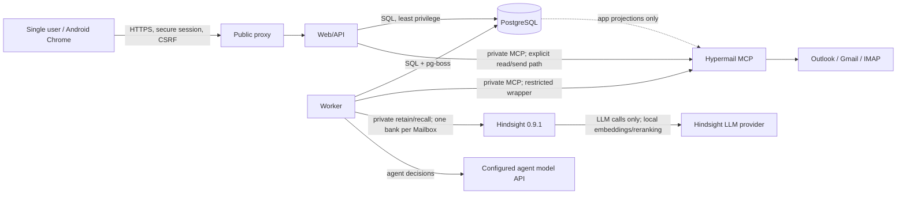
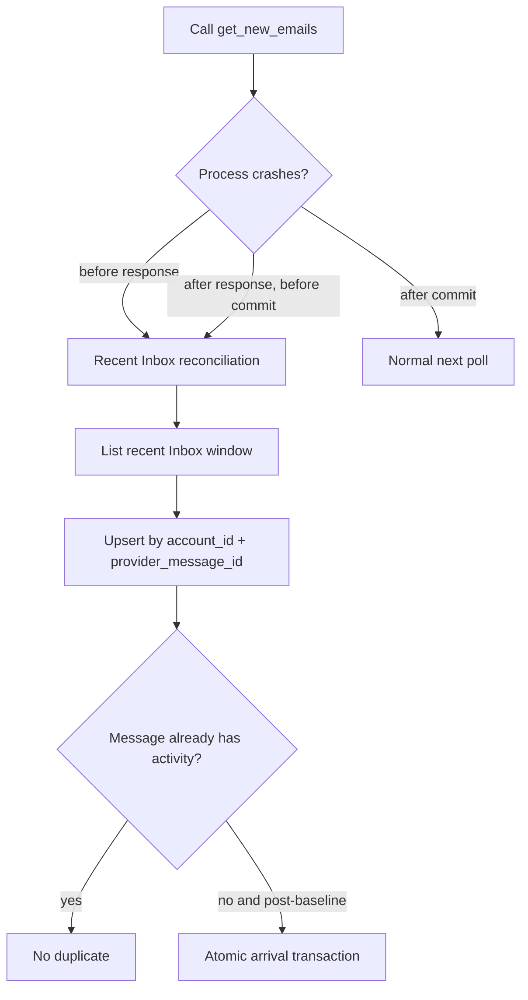
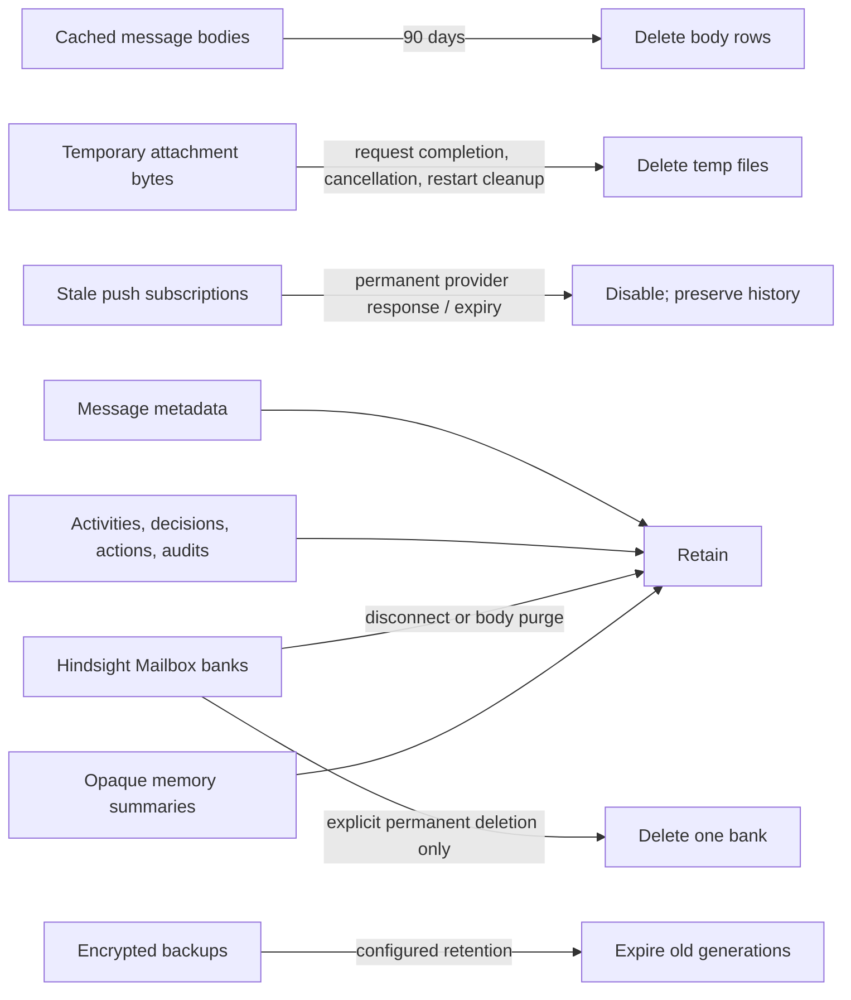

# Hypermail architecture

> Target architecture. Release acceptance on 2026-07-30 is **NO-GO**: web and worker runtime images are composed and smoke-tested, but live provider/device/deployment acceptance and the durable send service remain incomplete. See [`release/acceptance-matrix.md`](release/acceptance-matrix.md).

## Scope

Hypermail is a private, single-user, Android-first PWA. Only the HTTPS proxy and web service are internet reachable. PostgreSQL, the worker, Hypermail MCP, and Hindsight remain on private service ingress. Hindsight has outbound-only provider egress and no host port or edge-network attachment. Provider credentials and OAuth tokens stay in Hypermail encrypted state; the application database stores account projections only.

## Deployable services

| Service | Exposure | Responsibility |
|---|---|---|
| HTTPS proxy | Public 443 | TLS termination and routing to web |
| `apps/web` | Proxy only | PWA, authenticated API, recovery, explicit send and attachment delivery |
| `apps/worker` | Private | Polling, reconciliation, queue consumers, agent decisions, restricted mutations |
| Hypermail v0.7.26 | Private | Provider OAuth/IMAP state and mailbox MCP operations |
| Hindsight v0.9.1 | Private API; provider egress only | One durable memory bank per Mailbox; retain and recall |
| PostgreSQL | Private | `app`, `mastra`, and `pgboss` schemas |

## Trust boundaries



Email bodies, links, and attachment metadata are untrusted data. They cannot change system policy, expand tools, or authorize sends. The autonomous wrapper does not contain send, forward, permanent-delete, account-admin, or folder-admin capabilities.

## Arrival transaction

Every post-baseline Inbox arrival is recorded before agent processing. External Hypermail calls happen outside the database transaction.

```mermaid
sequenceDiagram
  participant S as Scheduler
  participant H as Hypermail
  participant W as Worker
  participant D as PostgreSQL app schema
  participant Q as pg-boss
  S->>W: acquire fenced singleton lease
  W->>H: get_new_emails(account)
  H-->>W: messages; external checkpoint advanced
  loop each provider identity
    W->>D: BEGIN
    W->>D: upsert message (account, provider_message_id)
    W->>D: insert activity if non-baseline
    W->>D: insert logical notification
    W->>D: insert agent_jobs outbox row
    W->>D: COMMIT
    W->>Q: enqueue deterministic job key
    W->>D: attach queue job id
  end
```

The four domain inserts are one transaction. Unique keys make replay harmless. pg-boss delivery is retried from `agent_jobs`; the domain row, not queue state, is the user-visible source of truth. The implemented scheduler accepts only 30–60 second intervals, acquires a renewable PostgreSQL lease, isolates account failures, and applies bounded per-account backoff. Baseline identities are projected with `is_baseline=true` before baseline completion and can never acquire an activity or job. A post-baseline received-time guard also prevents older baseline mail outside the bounded projection window from later becoming activity.

## Hypermail checkpoint crash gap

Hypermail advances its checkpoint outside the app transaction, so exactly-once ingestion across services is impossible.



Each poll is followed by a bounded recent-Inbox reconciliation. Provider identities define deduplication; the account baseline cutoff is a secondary guard for identities outside the bounded baseline window. Queue publication is an outbox-style replay: committed `agent_jobs` with no queue ID are repeatedly offered to pg-boss using a deterministic singleton key.

## Activity and push delivery

Activity reads and mutations are account-scoped PostgreSQL operations with stable `(created_at, id)` cursors and optimistic versions. Only `handled` activity with no open question or pending/running job may transition to `acknowledged`; history remains queryable. Retry requests reset the domain job and leave dispatch to the worker.

One `logical_notifications` row exists per activity. Push subscriptions are stored as endpoint hashes plus encrypted endpoint/key material. Delivery claims are unique per notification, subscription, and attempt; retryable failures become visible logical failures and are retried only by a later durable invocation. Payload projection includes sender label, subject, status, and activity deep-link IDs—never body or preview. HTTP 404/410 disables the stale subscription, while denied or unavailable browser permission retains the in-app pending badge.

## Agent and memory boundary

Hindsight v0.9.1 is the durable mailbox-memory service. A deterministic bank identifier maps each Mailbox to exactly one bank; banks are never shared between Mailboxes. The full image keeps embedded pg0 data at `/home/hindsight/.pg0`, runs with the stable worker ID `hypermail-hindsight-0`, and disables the bundled control plane. Neither port 8888 nor 9999 is published. Worker startup waits for Hindsight health, and worker readiness must verify the exact health version plus required retain, recall, and explicit delete-bank features before accepting work.

Mailbox disconnect stops new memory work but preserves the bank. Body-cache purge deletes only PostgreSQL cached bodies and does not affect the bank. Permanent deletion is a separate explicit owner/operator operation against the deterministic bank ID; it is never an autonomous agent capability. Encrypted backup copies remain until backup retention expires.

Mastra source history and Observational Memory use a stable User resource across all of that User's Mailboxes, with stable activity threads and a separate global-constraints resource. Hindsight remains separately isolated by User and Mailbox bank. The production triage path retains the current email, completes exact-Mailbox recall, then passes the User resource/thread to an Agent configured with Observational Memory in read-only mode. Sender-controlled email is never appended to User-global memory; only explicit User answers use the idempotent source-history append path. It validates structured output again at the application boundary and atomically persists deterministic decision/question attempts before policy work. Typed questions suspend in PostgreSQL and resume idempotently after restart. Derived Observational Memory remains opaque because the pinned public API cannot reliably inspect, correct, or reset it. No UI claims otherwise.

Hosted-agent schemas, authorization fences, OAuth/MCP foundations, and durable Task storage are additive foundations. They are not an active automatic delivery path yet: arrivals continue through the reviewed `agent_jobs` executor, and ingestion deliberately does not publish canonical `task_available` events until a transport returns durable receipts. The Hermes connector remains NO-GO until pairing/DPoP routes and task input projection are mounted.

The policy package is the sole autonomous mutation boundary. Its capability interface structurally omits send, forwarding, permanent delete, account administration, and folder management. Account onboarding remains structurally absent from autonomous worker, agent, and policy capability ports. It claims idempotency and pause state transactionally, performs provider I/O outside transactions with deterministic keys, retries only failures explicitly proven not applied, and records canonical post-action verification. Ambiguous interrupted mutations are verified without re-execution and never reported successful from reachability alone. Incorrect archive/move/trash outcomes update the rolling safety window; crossing the threshold atomically pauses that account and creates a separate synthetic safety Activity and notification.

## Protected user actions and PWA

An unauthenticated session exposes only a boolean zero-user bootstrap availability; exact-origin atomic first-owner bootstrap is authoritative, and signup is unavailable after creation. A signed-in session includes only safe user identity and mailbox projection data needed by the web UI.

Mailbox onboarding is an explicit authenticated owner action in the web service, reached from the More hub through Settings; it is not an autonomous capability. `POST /api/v1/mailboxes` and `POST /api/v1/mailboxes/complete` are exact-same-origin private routes. Gmail starts with an OAuth URL and returns through the same-origin `/oauth/gmail/callback`; browser `sessionStorage` retains only opaque provider, handle, and expiry values and the callback removes its query parameters. Outlook presents a device code and advances only when the owner explicitly checks status. IMAP onboarding is synchronous. IMAP credentials are submitted only to the private owner-only API and are never stored, logged, or echoed by the web service.

Hypermail retains provider credentials and encrypted provider state. The application projects `app.accounts` and `app.user_accounts` only after Hypermail reports the mailbox ready, maps Hypermail `outlook` to application `microsoft`, and fails closed on incompatible ownership. There is no mailbox removal flow. On the next ingestion cycle the worker establishes a new mailbox baseline, so pre-existing mail does not create Activity.

Browser draft mutations are authenticated, exact-origin POSTs with optimistic draft versions; browser actors are always attributed as `user`. Browser create/edit payloads declare `bodyFormat` (`html` for rich content or `markdown`), while agent/MCP composition always declares `markdown`; stored legacy drafts default to `markdown`. Rich HTML is canonicalized at the service boundary to the editor-supported tag and style allowlist before persistence. The format follows the immutable revision and approved-send snapshot so no boundary guesses how to interpret the body. Account exposes read-only owner email, current-password-verified password rotation through `POST /api/v1/auth/password`, and sign out. Password rotation preserves the existing password policy, revokes prior sessions, and creates a fresh current session. Replies accept only a source-message ID and re-read account-scoped sender/date/subject/body server-side before quoting. Send approval requires authentication within five minutes, binds a hashed explicit confirmation to one approval and draft version, expires after ten minutes, and transactionally re-reads/claims the draft before provider I/O. The isolated `packages/send` adapter forwards the immutable approved snapshot and deterministic key only to a private HTTPS endpoint. Hypermail v0.7 has no native idempotent send operation, so deployment of that private endpoint must durably deduplicate the key; direct MCP send is not represented as exactly-once.

Attachment delivery requires authenticated account scope and a private, non-symlink, non-world-writable attachment directory supplied by deployment. Provider paths must remain within it. Streaming enforces declared and actual byte limits, safe content headers, cancellation/backpressure, identity-checked cleanup, and bounded owned-orphan cleanup. Attachment bytes never enter Mastra Observational Memory or the direct decision-model input. The private worker may upload supported bounded files to the exact-Mailbox Hindsight bank, where the configured parser/LLM extracts and retains mailbox memory.

The web runtime mounts canonical authentication plus session-derived account-scoped mailbox, Activity, draft, agent, attachment, and push APIs. It validates its environment, cleans attachment orphans before listening, serves liveness, and drains gracefully. The worker runs `dist/main.js` and composes PostgreSQL, serial pg-boss queue creation and consumers, polling/reconciliation, lifecycle, model, notifications, restricted policy, recurring replay, private health, and graceful shutdown. Its readiness validates the pinned Hypermail runtime's advertised restricted mutation and draft schemas through `tools/list`; provider-specific mutation correctness remains a live-acceptance gate. The PWA service worker caches only the generic connectivity page, performs network-first document navigation, has no mail/API/attachment cache or offline write queue, and activates waiting updates only through the visible user control before reloading. The Android checklist remains deliberately unexecuted until a device is available.

## Retention



Body purging is bounded, leased, audited, and requires both the configured cache-age cutoff and the row's `purge_after`; it does not cascade to messages, activities, decisions, actions, notifications, or audits. Expired push subscriptions are disabled, not removed. Attachments are metadata-only in application PostgreSQL. Their temporary provider files are deleted after streaming, while supported content retained by Hindsight follows the Mailbox-bank lifecycle. Web startup must finish bounded owned-orphan cleanup before listening. Deployment gives web, worker, and Hypermail one mode-0700 named temp volume and common non-root UID; no other service receives that volume.

## Backup, observability, and security

The one-shot private backup job produces separate age-encrypted PostgreSQL custom dumps and Hypermail-state archives, uploads immutable generations and an encrypted integrity manifest to an off-host S3 prefix, prunes only exact owned generation artifacts, emits sanitized failure alerts, and is scheduled daily by the deployment platform. Database and state identities are distinct restricted secret files. Hindsight's live embedded pg0 volume is deliberately excluded because an online filesystem tar is not a consistent database snapshot. Development banks may be reset; production rollout remains blocked until a supported quiesced or logical Hindsight backup/restore drill exists.

Structured logs pass through bounded recursive redaction and static event names; correlation IDs are validated opaque values. Operational metrics use only fixed names/outcomes and never account/message labels. Health exposes safe liveness/readiness/degradation projections without errors, endpoints, or secrets. The web host applies CSP, HSTS, anti-framing/content-sniffing, permissions/cross-origin policies, bounded request sizes and throttling, and generic correlated errors. CI fails on high/critical production dependency or web/worker image findings; lower findings remain explicit release evidence.

## Failure and safety rules

- Polling, persistence, activity, push, and health continue while autonomy is paused.
- Unanswered questions and unresolved failures cannot be acknowledged.
- A successful agent action remains visible in New until manual acknowledgement.
- Post-action verification records `verified`, `failed`, or `unverifiable`; no silent success.
- At or above the configured incorrect archive/move/trash rate (maximum 1%), one transaction pauses the account and creates an alert/audit.
- Send is a separate web-only, fresh-auth, CSRF-safe confirmation path that re-reads the draft and uses an idempotency key.
