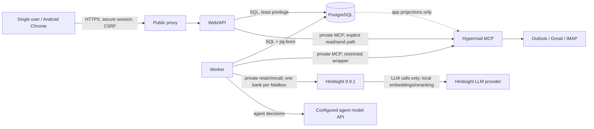
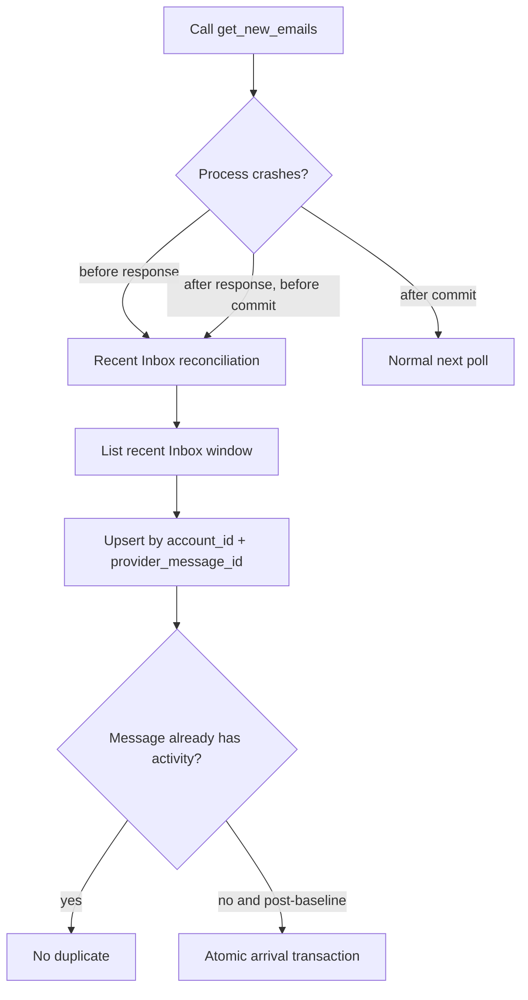
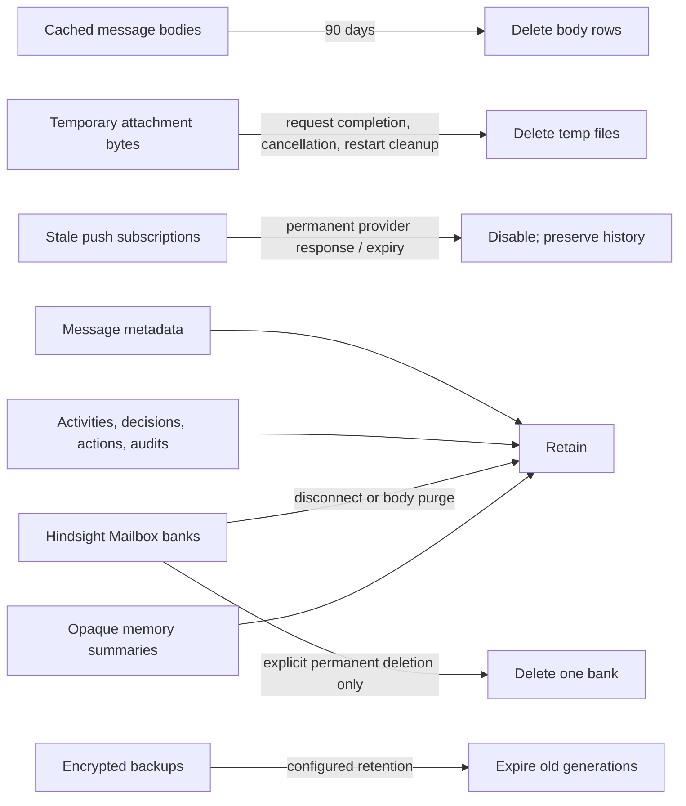

# Hypermail architecture

> Target architecture. Release acceptance on 2026-07-30 is **NO-GO**: web and worker runtime images are composed and smoke-tested, but live provider/device/deployment acceptance and the durable send service remain incomplete. See [`release/acceptance-matrix.md`](release/acceptance-matrix.md).

## Scope

Hypermail is a private, single-user, Android-first PWA. Only the HTTPS proxy and web service are internet reachable. PostgreSQL, the worker, Hypermail MCP, and Hindsight remain on private service ingress. Hindsight has outbound-only provider egress and no host port or edge-network attachment. Provider credentials and OAuth tokens stay in Hypermail encrypted state; the application database stores account projections only.

## Deployable services

| Service | Exposure | Responsibility |
|---|---|---|
| HTTPS proxy | Public 443 | TLS termination and routing to web |
| `apps/web` | Proxy only | PWA, authenticated API, recovery, explicit send and attachment delivery |
| `apps/worker` | Private | Polling, reconciliation, queue consumers, agent decisions, restricted mutations |
| Hypermail v0.7.26 | Private | Provider OAuth/IMAP state and mailbox MCP operations |
| Hindsight v0.9.1 | Private API; provider egress only | One durable memory bank per Mailbox; retain and recall |
| PostgreSQL | Private | `app`/`pgboss`, historical `mastra` namespace, and native Mastra-owned `public.mastra_*` tables |

## Trust boundaries

```mermaid
flowchart LR
  U[Single user / Android Chrome] -->|HTTPS, secure session, CSRF| P[Public proxy]
  P --> W[Web/API]
  W -->|SQL, least privilege| DB[(PostgreSQL)]
  W -->|private MCP; explicit read/send path| H[Hypermail MCP]
  K[Worker] -->|SQL + pg-boss| DB
  K -->|private MCP; restricted wrapper| H
  K -->|private retain/recall; one bank per Mailbox| HS[Hindsight 0.9.1]
  HS -->|LLM calls only; local embeddings/reranking| M[Hindsight LLM provider]
  K -->|agent decisions| AM[Configured agent model API]
  H --> O[Outlook / Gmail / IMAP]
  DB -. app projections only .-> H
```

Email bodies, links, and attachment metadata are untrusted data. They cannot change system policy, expand tools, or authorize sends. The autonomous wrapper does not contain send, forward, permanent-delete, account-admin, or folder-admin capabilities.

## Arrival transaction

Every post-baseline Inbox arrival is recorded before agent processing. External Hypermail calls happen outside the database transaction.

```mermaid
sequenceDiagram
  participant S as Scheduler
  participant H as Hypermail
  participant W as Worker
  participant D as PostgreSQL app schema
  participant Q as pg-boss
  S->>W: acquire fenced singleton lease
  W->>H: get_new_emails(account)
  H-->>W: messages; external checkpoint advanced
  loop each provider identity
    W->>D: BEGIN
    W->>D: upsert message (account, provider_message_id)
    W->>D: insert activity if non-baseline
    W->>D: insert logical notification
    W->>D: insert agent_jobs outbox row
    W->>D: COMMIT
    W->>Q: enqueue deterministic job key
    W->>D: attach queue job id
  end
```

The four domain inserts are one transaction. Unique keys make replay harmless. pg-boss delivery is retried from `agent_jobs`; the domain row, not queue state, is the user-visible source of truth. The implemented scheduler accepts only 30–60 second intervals, acquires a renewable PostgreSQL lease, isolates account failures, and applies bounded per-account backoff. Baseline identities are projected with `is_baseline=true` before baseline completion and can never acquire an activity or job. A post-baseline received-time guard also prevents older baseline mail outside the bounded projection window from later becoming activity.

## Hypermail checkpoint crash gap

Hypermail advances its checkpoint outside the app transaction, so exactly-once ingestion across services is impossible.

```mermaid
flowchart TD
  A[Call get_new_emails] --> B{Process crashes?}
  B -->|before response| R[Recent Inbox reconciliation]
  B -->|after response, before commit| R
  B -->|after commit| N[Normal next poll]
  R --> L[List recent Inbox window]
  L --> U[Upsert by account_id + provider_message_id]
  U --> C{Message already has activity?}
  C -->|yes| D[No duplicate]
  C -->|no and post-baseline| T[Atomic arrival transaction]
```

Each poll is followed by a bounded recent-Inbox reconciliation. Provider identities define deduplication; the account baseline cutoff is a secondary guard for identities outside the bounded baseline window. Queue publication is an outbox-style replay: committed `agent_jobs` with no queue ID are repeatedly offered to pg-boss using a deterministic singleton key.

## Activity and push delivery

Activity reads and mutations are owner/account-scoped PostgreSQL operations with stable `(created_at, id)` cursors and optimistic versions. Acknowledgement independently checks proposals, canonical and legacy actions, Runs, jobs and questions inside the transaction; a stale `handled` projection cannot bypass unresolved work. Pending individual review remains in Questions. Rejected and superseded proposals are owner decisions, not failures; blocked dependencies and failed or unverifiable operations remain in attention. Retry cannot retriage an Activity with proposals.

The authenticated review API exposes `GET /api/v1/agent/proposals?activityId=<uuid>` and selectable owner-scoped folders at `GET /api/v1/agent/folders?accountId=<uuid>`. `POST /api/v1/agent/proposals/:id/review` requires exact Origin, session, positive `expectedRevision`, an `idempotencyKey`, and `decision: approve|reject|correct`; optional comments never mutate an action. Correction requires an explicit validated action snapshot. Invalid input returns 400, missing ownership 404, stale revision or incompatible idempotency content 409, and prohibited target/capability 422. Same-key, same-content replay returns the immutable review. Web records ready proposals; the worker performs durable authorization and dispatch without rerunning triage or replaying completed siblings.

Review cards show the immutable action, estimated confidence, threshold, reason, evidence, dependencies and written execution state. Structured correction keeps the mailbox and source target fixed and uses actual selectable folders and shared draft validation. Only the submitted card is pending. A conflict preserves typed content and requires explicit reload and inspection before another submission; reload does not resubmit automatically.

One `logical_notifications` row exists per activity. The first delivery freezes the enabled devices in durable `notification_targets` under its notification lock; later devices are not retroactively added. Delivered devices are never retried, and disabled or expired undelivered devices become suppressed. Delivery attempts have fenced UUID claims with 120-second leases, a three-attempt durable ceiling, and a 30-second provider timeout. Recovery expires crashed claims as `DELIVERY_LEASE_EXPIRED`; stale workers cannot finish a replacement claim. No database transaction spans a provider call.

Logical state aggregates all targets: `delivering` requires a live lease, `pending` means retryable work remains, terminal `failed` exposes partial failure even if another device succeeded, `delivered` requires all devices delivered/suppressed and at least one delivered, and all suppressed (including zero devices) yields `suppressed`. `deliveredCount`, `failedCount`, and `pendingCount` expose this aggregate; terminal failures are not endlessly redispatched. Payload projection includes sender label, subject, status, and activity deep-link IDs—never body or preview. HTTP 404/410 disables the stale subscription, while denied or unavailable browser permission retains the in-app pending badge. A crash after provider acceptance but before the durable acknowledgement can duplicate a push; the service worker uses the notification ID as a replacement tag to reduce visible duplicates. Push has no delivery-time SLA.

## Agent and memory boundary

Hindsight v0.9.1 is the durable mailbox-memory service. A deterministic bank identifier maps each Mailbox to exactly one bank; banks are never shared between Mailboxes. The full image keeps embedded pg0 data at `/home/hindsight/.pg0`, runs with the stable worker ID `hypermail-hindsight-0`, and disables the bundled control plane. Neither port 8888 nor 9999 is published. Worker startup waits for Hindsight health, and worker readiness must verify the exact health version plus required retain, recall, and explicit delete-bank features before accepting work.

Mailbox disconnect stops new memory work but preserves the bank. Body-cache purge deletes only PostgreSQL cached bodies and does not affect the bank. Permanent deletion is a separate explicit owner/operator operation against the deterministic bank ID; it is never an autonomous agent capability. Encrypted backup copies remain until backup retention expires.

Mastra source history and read-only Observational Memory use `user:<userId>:mailbox:<accountId>:v2` for triage and mailbox chat, and `user:<userId>:global:v2` only for explicitly global chat. Legacy `user:<userId>` resources remain historical and are never recalled or converted into global preferences. System constraints use a separate resource. Owner history is reconstructed from attributable SQL conversation messages, question answers and reviews; assistant replies and email documents are never owner instructions. Before generation, the mailbox-memory barrier waits for owner events accepted before the immutable job/turn cutoff; memory failures defer work rather than erase context. Current email retention and bounded exact-mailbox recall precede validated, transactional decision persistence.

Native triage uses a provider wire envelope `{decision: …}` through Mastra's public Standard Schema API. Exclusive literal-tag unions are emitted as `anyOf`, and email uses `format=email` without unsupported regex lookaround; the canonical strict Zod v2 validator still rejects malformed decisions before persistence. The extracted decision, not the provider envelope, is stored. Provider token budgets and the 8000-character application evidence envelope are distinct limits; owner corrections must not be discarded merely because metadata consumes bytes.

The read-only conversation Agent shares the configured model but has no mutation tools. SQL owns immutable messages, request digests, contiguous sequences, and one assistant reply per owner message. `conversation.respond` uses fenced 120-second claims renewed every 30 seconds; crashes may repeat model generation, never publish two replies. Temporary model failures use three durable attempts; memory deferrals do not consume that budget. Only the latest twenty SQL messages plus scoped Observational Memory are supplied. Global conversations never load a mailbox or attached email; explicit global owner messages fan out to ready mailbox banks and are backfilled in pages of 100 for future mailboxes.

Conversation APIs expose owner-scoped create/list, paged messages, idempotent posting with `expectedVersion`, and retry of the original failed turn. Reusing a request identity with changed content or a stale version returns conflict. Chat preserves unsent text on errors, requires explicit reload after conflict, labels mailbox/global scope, and deep-links to `/chat/:conversationId`. A mailbox conversation can attach one immutable owner-scoped email context without creating a new arrival.

Hosted-agent schemas, authorization fences, OAuth/MCP foundations, and durable Task storage are additive foundations. They are not an active automatic delivery path yet: arrivals continue through the reviewed `agent_jobs` executor, and ingestion deliberately does not publish canonical `task_available` events until a transport returns durable receipts. The Hermes connector remains NO-GO until pairing/DPoP routes and task input projection are mounted.

The policy package is the sole autonomous mutation boundary. Its capability interface structurally omits send, forwarding, permanent delete, account administration, and folder management. Account onboarding remains structurally absent from autonomous worker, agent, and policy capability ports. It claims idempotency and pause state transactionally, performs provider I/O outside transactions with deterministic keys, retries only failures explicitly proven not applied, and records canonical post-action verification. Ambiguous interrupted mutations are verified without re-execution and never reported successful from reachability alone. Incorrect archive/move/trash outcomes update the rolling safety window; crossing the threshold atomically pauses that account and creates a separate synthetic safety Activity and notification.

## Protected user actions and PWA

An unauthenticated session exposes only a boolean zero-user bootstrap availability; exact-origin atomic first-owner bootstrap is authoritative, and signup is unavailable after creation. A signed-in session includes only safe user identity and mailbox projection data needed by the web UI.

Password rotation verifies the current password before hashing its replacement, then atomically replaces credentials and revokes existing sessions under the same owner lock used by recovery reset. This transaction requires both the exact verified password hash and an initiating session that is still unrevoked and unexpired after lock waits. A winning reset, revocation, expiry or credential change rejects the stale rotation without changing the winner's password or issuing a session. Successful rotation issues its replacement session against the new hash; session creation retains its expected-password-hash fence against a subsequent reset.

Mailbox onboarding is an explicit authenticated owner action in the web service, reached from the More hub through Settings; it is not an autonomous capability. `POST /api/v1/mailboxes` and `POST /api/v1/mailboxes/complete` are exact-same-origin private routes. Gmail starts with an OAuth URL and returns through the same-origin `/oauth/gmail/callback`; browser `sessionStorage` retains only opaque provider, handle, and expiry values and the callback removes its query parameters. Outlook presents a device code and advances only when the owner explicitly checks status. IMAP onboarding is synchronous. IMAP credentials are submitted only to the private owner-only API and are never stored, logged, or echoed by the web service.

Hypermail retains provider credentials and encrypted provider state. The application projects `app.accounts` and `app.user_accounts` only after Hypermail reports the mailbox ready, maps Hypermail `outlook` to application `microsoft`, and fails closed on incompatible ownership. There is no mailbox removal flow. On the next ingestion cycle the worker establishes a new mailbox baseline, so pre-existing mail does not create Activity.

Browser draft mutations are authenticated, exact-origin POSTs with optimistic draft versions; browser actors are always attributed as `user`. Browser create/edit payloads declare `bodyFormat` (`html` for rich content or `markdown`), while agent/MCP composition always declares `markdown`; stored legacy drafts default to `markdown`. Rich HTML is canonicalized at the service boundary to the editor-supported tag and style allowlist before persistence. The format follows the immutable revision and approved-send snapshot so no boundary guesses how to interpret the body. Account exposes read-only owner email, current-password-verified password rotation through `POST /api/v1/auth/password`, and sign out. Password rotation preserves the existing password policy, revokes prior sessions, and creates a fresh current session. Replies accept only a source-message ID and re-read account-scoped sender/date/subject/body server-side before quoting. Send approval requires authentication within five minutes, binds a hashed explicit confirmation to one approval and draft version, expires after ten minutes, and transactionally re-reads/claims the draft before provider I/O.

Owner-approved sending is a private web-process service, not a daemon or external bridge. Consuming approval atomically inserts an immutable journal snapshot; one committed dispatch CAS precedes provider I/O. Submission acknowledgement, read-only Sent proof and owner manual testimony remain separate states. Timeout/restart ambiguity never leads to automatic resend. Reconciliation routes require owner scope and the displayed source version; only provider verification marks sent. The restricted send transport is not available to agents, policies, chat or the public MCP proxy.

Attachment delivery requires authenticated account scope and a private, non-symlink, non-world-writable attachment directory supplied by deployment. Provider paths must remain within it. Streaming enforces declared and actual byte limits, safe content headers, cancellation/backpressure, identity-checked cleanup, and bounded owned-orphan cleanup. Attachment bytes never enter Mastra Observational Memory or the direct decision-model input. The private worker may upload supported bounded files to the exact-Mailbox Hindsight bank, where the configured parser/LLM extracts and retains mailbox memory.

The web runtime mounts canonical authentication plus session-derived account-scoped mailbox, Activity, draft, agent, attachment, and push APIs. It validates its environment, cleans attachment orphans before listening, serves liveness, and drains gracefully. The worker runs `dist/main.js` and composes PostgreSQL, serial pg-boss queue creation and consumers, polling/reconciliation, lifecycle, model, notifications, restricted policy, recurring replay, private health, and graceful shutdown. Its readiness validates the pinned Hypermail runtime's advertised restricted mutation and draft schemas through `tools/list`; provider-specific mutation correctness remains a live-acceptance gate. The PWA service worker caches only the generic connectivity page, performs network-first document navigation, has no mail/API/attachment cache or offline write queue, and activates waiting updates only through the visible user control before reloading. The Android checklist remains deliberately unexecuted until a device is available.

## Retention

```mermaid
flowchart LR
  MB[Cached message bodies] -->|90 days| PURGE[Delete body rows]
  TMP[Temporary attachment bytes] -->|request completion, cancellation, restart cleanup| CLEAN[Delete temp files]
  PS[Stale push subscriptions] -->|permanent provider response / expiry| DISABLE[Disable; preserve history]
  META[Message metadata] --> KEEP[Retain]
  ACT[Activities, decisions, actions, audits] --> KEEP
  BANK[Hindsight Mailbox banks] -->|disconnect or body purge| KEEP
  BANK -->|explicit permanent deletion only| DROP[Delete one bank]
  OM[Opaque memory summaries] --> KEEP
  BACKUP[Encrypted backups] -->|configured retention| EXPIRE[Expire old generations]
```

Body purging is bounded, leased, audited, and requires both the configured cache-age cutoff and the row's `purge_after`; it does not cascade to messages, activities, decisions, actions, notifications, or audits. Expired push subscriptions are disabled, not removed. Attachments are metadata-only in application PostgreSQL. Their temporary provider files are deleted after streaming, while supported content retained by Hindsight follows the Mailbox-bank lifecycle. Web startup must finish bounded owned-orphan cleanup before listening. Deployment gives web, worker, and Hypermail one mode-0700 named temp volume and common non-root UID; no other service receives that volume.

## Backup, observability, and security

The one-shot private backup job produces separate age-encrypted PostgreSQL custom dumps and Hypermail-state archives, uploads immutable generations and an encrypted integrity manifest to an off-host S3 prefix, prunes only exact owned generation artifacts, emits sanitized failure alerts, and is scheduled daily by the deployment platform. Database and state identities are distinct restricted secret files. Hindsight's live embedded pg0 volume is deliberately excluded because an online filesystem tar is not a consistent database snapshot. Development banks may be reset; production rollout remains blocked until a supported quiesced or logical Hindsight backup/restore drill exists.

Structured logs pass through bounded recursive redaction and static event names; correlation IDs are validated opaque values. Operational metrics use only fixed names/outcomes and never account/message labels. Health exposes safe liveness/readiness/degradation projections without errors, endpoints, or secrets. The web host applies CSP, HSTS, anti-framing/content-sniffing, permissions/cross-origin policies, bounded request sizes and throttling, and generic correlated errors. CI fails on high/critical production dependency or web/worker image findings; lower findings remain explicit release evidence.

## Failure and safety rules

- Polling, persistence, activity, push, and health continue while autonomy is paused.
- Unanswered questions and unresolved failures cannot be acknowledged.
- A successful agent action remains visible in New until manual acknowledgement.
- Post-action verification records `verified`, `failed`, or `unverifiable`; no silent success.
- Owner-confirmed Settings activation atomically assigns Hypermail AI, enables automatic processing, and grants only mail/folder/attachment reading plus archive, move, recoverable trash and draft creation/editing. Revision histories and approval audit remain immutable; migration and onboarding do not activate mailboxes.
- Global autonomy pause is stored on the owner and enforced at the final mutation fence, including mailboxes attached later. It does not replace independent mailbox safety pauses.
- Verified archive/move/trash successes and observed verification mismatches enter an append-only, action-deduplicated safety journal. The sliding window excludes technical failures and unknown results. At or above the configured incorrect ratio (default 1% over one hour), one transaction pauses the account and creates a canonical safety Activity, legacy projection, audit and logical notification once per pause.
- Folder readback uses bounded pages of 100 (at most 50 per call) and a durable verification cursor. Incomplete scans resume read-only through recovery; absence is established only at provider end-of-list. The immutable 15-minute deadline ends as `VERIFICATION_WINDOW_EXHAUSTED`, never another mutation.
- Send is a separate web-only, fresh-auth, CSRF-safe confirmation path that re-reads the draft and uses an idempotency key.
