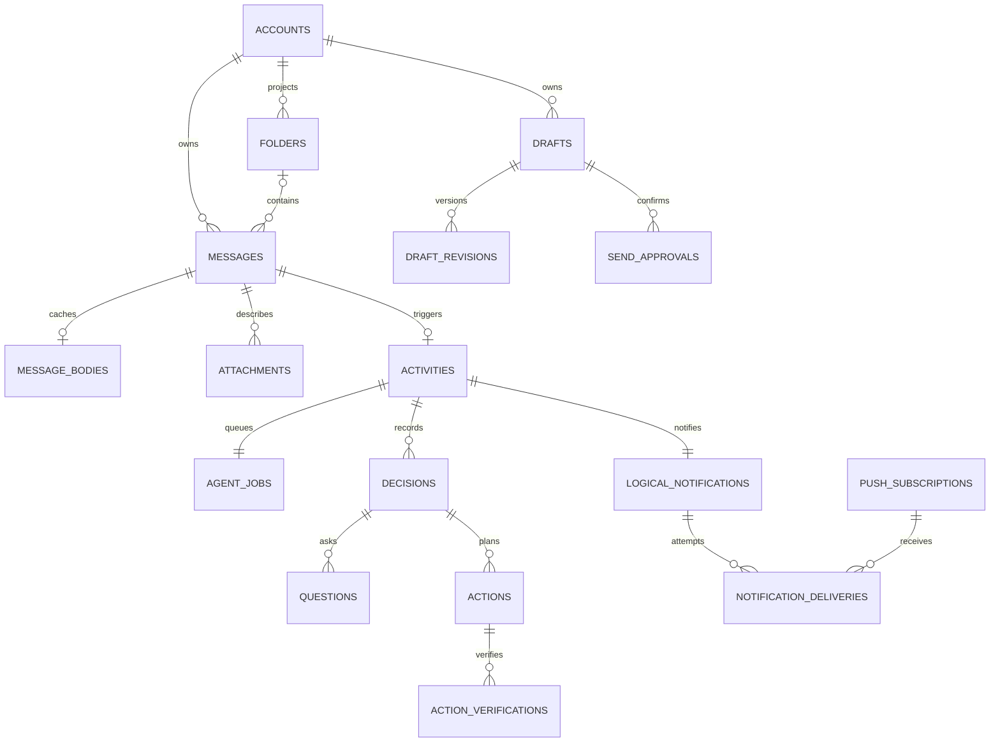

# Hypermail data model

The authoritative Drizzle schema is [`packages/db/src/schema.ts`](../packages/db/src/schema.ts). Generated migrations are immutable after application to a shared environment.

## PostgreSQL schemas

- `app`: all Hypermail domain and authentication records.
- `mastra`: owned and migrated by Mastra `PostgresStore`; application migrations create only the namespace.
- `pgboss`: owned and migrated by pg-boss; application migrations create only the namespace.

Application code must not write directly to Mastra or pg-boss internal tables.

## Record groups

| Group | Tables | Retention |
|---|---|---|
| Authentication | Better Auth `auth_users`, `auth_sessions`, `auth_accounts`, `auth_verifications`, `auth_rate_limits`; bootstrap/recovery `users`, `sessions`, `recovery_tokens`, `rate_limits` | Sessions/tokens bounded; audit outcomes retained |
| Account projections | `accounts`, `user_accounts`, `folders`, `account_health`, `poll_states` | Retained; mailbox removal is unavailable; no provider secrets |
| Mail cache | `messages`, `message_bodies`, `attachments` | Metadata retained; bodies purged after 90 days; no attachment bytes |
| Activity | `activities`, `agent_jobs`, `questions`, `decisions` | Indefinite |
| Hosted-agent foundation | `agent_connections`, Manager assignments/revisions, capability grants/revisions, canonical Agent activities/runs/actions, durable Task history | Identity retained; completed Task result payloads minimized |
| Mailbox-memory projection | `mailbox_memory_events` | Event identity and sanitized delivery outcome retained; temporary content payload removed after successful retain |
| Actions | `actions`, `action_verifications`, `safety_windows` | Indefinite |
| Draft/send | `drafts`, `draft_revisions`, `send_approvals` | History retained; approvals expire and are single-use |
| Push | `logical_notifications`, `push_subscriptions`, `notification_deliveries` | Logical history retained; stale subscriptions cleaned |
| Coordination/audit | `scheduler_leases`, `audits` | Lease ephemeral; audits indefinite |

## Identity and idempotency invariants

1. A provider message is unique by `(account_id, provider_message_id)`.
2. A provider folder is unique by `(account_id, provider_folder_id)`.
3. At most one activity exists for a message.
4. At most one logical notification and one agent job exist for an activity.
5. Queue, action, send-approval, and external side effects use deterministic unique idempotency keys.
6. One open question may exist per activity.
7. Notification delivery attempts are unique by notification, subscription, and attempt.
8. Account records contain provider identifiers and health only, never OAuth or IMAP credentials.
9. A Mailbox-memory event is unique by `(user_id, account_id, source_type, source_id, source_version, kind)`. Its stable UUID and content digest never change.

## State ownership

Domain state is authoritative even when a library also tracks execution:

- `agent_jobs.state` is the user-visible job state; pg-boss is delivery machinery. Canonical durable Task storage is present, but arrival execution remains on this legacy path until a real Mastra/external transport and receipt-producing outbox publisher are mounted. Ingestion does not create deliverable canonical Tasks in the interim.
- `activities.state` is the user-visible review state; Mastra workflow state does not close it.
- `actions.state` plus `action_verifications` determine mutation outcome; a provider response alone is not verified success.
- `logical_notifications` represent the one-notification-per-activity promise; delivery attempts may be many.
- `mailbox_memory_events` are the canonical delivery outbox for the learned Hindsight projection. Hindsight is not authoritative domain or audit storage.

Legal state edges are encoded in [`packages/contracts/src/transitions.ts`](../packages/contracts/src/transitions.ts). Unknown fields and forbidden autonomous action kinds are rejected by strict Zod contracts.

## Core relationships

## Atomic post-baseline arrival

Within one `app` transaction:

1. Upsert the message by provider identity.
2. If the account baseline is complete and the message is a new Inbox arrival, insert its activity.
3. Insert the logical notification using the activity ID.
4. Insert the agent job/outbox row using a deterministic key.

Commit before queue publication or model/provider calls. A replay either finds the complete records or retries the whole transaction; uniqueness prevents duplicate visible work. Baseline projection writes only `messages` rows with `is_baseline=true`; arrival SQL excludes those identities and messages received before the account baseline cutoff.

## Phase 4 persistence rules

- `scheduler_leases` elects one polling scheduler; each ready account is polled independently and records bounded backoff in `poll_states` plus sanitized status in `account_health`.
- Pending `agent_jobs` without `queue_job_id` form the durable dispatch outbox. pg-boss singleton keys prevent duplicate queue deliveries after commit/mark-dispatched crashes.
- Activity list cursors are the descending `(created_at, id)` tuple. Acknowledgement uses a row lock and version compare-and-swap, and requires `handled` state with no open question or active retry.
- Push endpoints and key material are encrypted; only endpoint hashes are used for idempotent subscription identity. Delivery attempts are claimed under a notification lock and uniquely numbered.
- Retryable push failures transition `delivering -> failed`; a later durable invocation performs `failed -> pending -> delivering`. Provider 404/410 responses permanently disable that subscription.
- Triage attempts use deterministic decision/question UUIDs and unique `(activity_id, attempt)` identity. One transaction persists the canonical decision, optional question, Activity state, and domain job state; conflicting input digests are rejected.
- Question answers are single-claim records. Durable audit correlations make API retries idempotent, while Mastra workflow snapshots resume typed input by stable question ID.
- Policy action idempotency binds the key to activity, decision, kind, target, and precondition. `executing` replays are verified rather than re-executed; ambiguous outcomes become `unverifiable`.
- Safety threshold alerts use a deterministic synthetic `messages` identity per account/window, a separate failed Activity, and its own logical notification so the arrival notification is never overwritten.
- Every draft edit increments `drafts.version` and appends one immutable `draft_revisions` snapshot with `user` or internal `agent` attribution. Browser routes force `user`; reply context is read from an account-scoped source message. `drafts.body_format` and each revision snapshot carry the body representation: `markdown` for migrated and agent-created drafts, or `html` for rich browser drafts. The database defaults existing rows and legacy revision snapshots to `markdown`.
- A send approval binds user, draft ID/version, approval-specific confirmation hash, deterministic idempotency key, and expiry. Confirmation locks both approval and draft, rejects stale/consumed/mismatched records, then moves the draft to `sending` before external I/O. Success becomes `sent`; provider failure becomes editable `failed` without losing content; all boundaries are audited.
- Temporary attachment bytes are outside PostgreSQL in one deployment-owned private directory. Stream lifecycle and restart cleanup remove bytes while attachment metadata remains.

## Mailbox-memory event delivery

`mailbox_memory_events` belongs to exactly one `(user_id, account_id)` ownership edge. A composite restrictive foreign key rejects cross-User/Mailbox rows. Source identity is a stable UUID plus a positive source version and machine-token source/event kinds. Duplicate domain delivery returns the existing logical event only when its immutable content digest and timing match.

Claim commits a bounded batch before it returns work. It increments both the attempt count and claim generation and assigns an opaque claim token. Hindsight retain or operation polling must run only after that transaction commits. Completion and deferral then require the event UUID, User UUID, Mailbox UUID, generation, and token. Expired claims are recovered with `FOR UPDATE SKIP LOCKED`; stale workers cannot complete or defer a newer generation. Retrying the same external retain uses the stable event UUID, so crashes before or after Hindsight accepts it converge without changing Mailbox scope.

Deferral stores only a bounded machine error code and small JSON metadata and applies exponential delay capped at fifteen minutes. Automatic delivery remains pending and retries until memory becomes available; it does not close or rewrite visible Activity, job, or Task state. Content needed to retry remains in `content_payload`; successful completion removes that duplicate payload while retaining source identity, digest, delivery counters/timing, and sanitized result metadata. Attachment bytes never enter this table. Audits and logs receive only identifiers, codes, and digests, never the payload.

### Forward-only learning transitions (Issue #33)

V1 writes learning events only as part of new canonical transitions. There is no historical backfill. The canonical transaction enqueues question answers; draft creation and every immutable revision; explicit owner send confirmation or rejection; authoritative send outcomes; and verified, failed, or unverifiable organize, read/unread, and draft actions. Stale, conflicting, replayed, cancelled, or unchanged paths do not enqueue a new event. A failed or unverifiable action uses a distinct outcome kind and is never represented as verified.

Event UUIDs are deterministically derived from User, Mailbox, source type/UUID/version, and event kind. Draft corrections carry bounded before/after recipients, subject, and body evidence. Text is capped at 16,000 characters and always includes a SHA-256 digest plus a truncation flag. Event payloads are capped at 64 KiB. Provider receipts, credentials, attachment bytes, confirmation secrets, and raw provider errors are excluded. The enqueue helper accepts an existing PostgreSQL transaction and performs no Hindsight or other external I/O.

## Deletion and retention behavior

- Mailbox removal is not available. Activities/actions use restrictive foreign keys so any future mailbox cleanup cannot erase decision history accidentally.
- Body purge selects bounded due rows using both cache age and `purge_after`, deletes `message_bodies` only, and inserts one `message_body_purged` audit per row in the same statement.
- Expired push subscriptions receive `disabled_at` plus an audit; subscription and delivery records remain.
- Provider deletion is represented on message metadata (`deleted_at`) rather than erasing history.
- Completed Mailbox-memory events retain immutable source identity, content digest, and sanitized outcome metadata; their duplicate `content_payload` is removed. Pending/deferred events keep only content required for replay.
- Audit metadata must contain identifiers, codes, and digests—not credentials, full message bodies, or attachment bytes.
