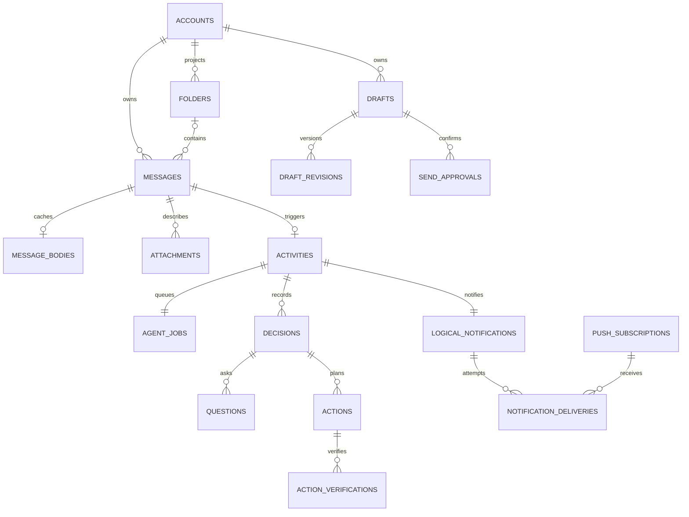

# Hypermail data model

The authoritative Drizzle schema is [`packages/db/src/schema.ts`](../packages/db/src/schema.ts). Generated migrations are immutable after application to a shared environment.

## PostgreSQL schemas

- `app`: all Hypermail domain and authentication records.
- `mastra`: historical/reserved namespace created by application migrations. The current native `PostgresStore` uses its default `public.mastra_*` tables, owned/migrated through Mastra APIs. Backups dump the complete database, including `public`; the controlled restore comparison is not native OM restoration evidence.
- `pgboss`: owned and migrated by pg-boss; application migrations create only the namespace.

Application code must not write directly to Mastra or pg-boss internal tables.

## Record groups

| Group | Tables | Retention |
|---|---|---|
| Authentication | Better Auth `auth_users`, `auth_sessions`, `auth_accounts`, `auth_verifications`, `auth_rate_limits`; bootstrap/recovery `users`, `sessions`, `recovery_tokens`, `rate_limits` | Sessions/tokens bounded; audit outcomes retained |
| Account projections | `accounts`, `user_accounts`, `folders`, `account_health`, `poll_states` | Retained; mailbox removal is unavailable; no provider secrets |
| Mail cache | `messages`, `message_bodies`, `attachments` | Metadata retained; bodies purged after 90 days; no attachment bytes |
| Activity | `activities`, `agent_jobs`, `questions`, `decisions` | Indefinite |
| Hosted-agent foundation | `agent_connections`, Manager assignments/revisions, capability grants/revisions, canonical Agent activities/runs/actions, durable Task history | Identity retained; completed Task result payloads minimized |
| Mailbox-memory projection | `mailbox_memory_events` | Canonical event history retained; temporary content payload removed after successful retain or permanent-bank cancellation |
| Scoped conversations | `agent_conversations`, `agent_conversation_messages`, `agent_conversation_turns`, `agent_global_memory_backfills` | Immutable history, fenced temporary claims, persistent global backfill watermark |
| Actions | `actions`, `action_verifications`, `safety_windows` | Indefinite |
| Draft/send | `drafts`, `draft_revisions`, `send_approvals` | History retained; approvals expire and are single-use |
| Push | `logical_notifications`, `push_subscriptions`, `notification_targets`, `notification_deliveries` | Fixed recipient set and attempt history retained; terminal subscription material remains encrypted |
| Coordination/audit | `scheduler_leases`, `audits` | Lease ephemeral; audits indefinite |

Push recipient identity is `(notification_id, subscription_id)` and freezes when `targets_initialized_at` is set, including an empty recipient set. Attempt identity is `(notification_id, subscription_id, attempt)` with a maximum of three attempts; UUID `claim_token` and a 120-second `claim_expires_at` fence each pending attempt. Completion clears the lease and atomically updates its target. Logical `delivered_count`, `failed_count`, and `pending_count` aggregate targets rather than the successes of one worker invocation.

## Identity and idempotency invariants

1. A provider message is unique by `(account_id, provider_message_id)`.
2. A provider folder is unique by `(account_id, provider_folder_id)`.
3. At most one activity exists for a message.
4. At most one logical notification and one agent job exist for an activity.
5. Queue, action, send-approval, and external side effects use deterministic unique idempotency keys.
6. One open question may exist per activity.
7. Notification delivery attempts are unique by notification, subscription, and attempt.
8. Account records contain provider identifiers and health only, never OAuth or IMAP credentials.
9. A Mailbox-memory event is unique by `(user_id, account_id, source_type, source_id, source_version, kind)`. Its stable UUID and content digest never change.
10. Model action plans use decision schema version 2. Each action has an immutable key, estimated confidence, rationale, evidence references, and explicit dependency keys. At most five actions are accepted, with no dependency cycle or competing classification for one message.

### Decision schema cutover

The version-2 model contract permits only archive, move, recoverable trash, draft creation, and draft editing. Read-state changes and sending remain outside automatic triage. Draft creation includes a Markdown snapshot and source message, not an invented draft UUID; draft editing names an existing draft and expected version. Shared draft-field schemas preserve owner-authored HTML.

Migrations `0015`–`0019` introduce proposal/review history, scoped conversations, delivery safety, approved-send submissions, and encrypted recovery delivery records. Existing decisions remain version 1, readable but non-executable. The migration cancels only unstarted legacy actions and surfaces attention; interrupted provider operations require read-only verification, never a replacement mutation. New decisions freeze their canonical Run identity at persistence instead of following a reused job's current Run.

Confidence is an estimate, not a calibrated probability or permission. An owner approval does not replace the model's score. Release acceptance remains NO-GO until the end-to-end scenarios and operational gates in the approved implementation plan have been exercised.

## State ownership

Domain state is authoritative even when a library also tracks execution:

- `agent_jobs.state` is the user-visible job state; pg-boss is delivery machinery. Canonical durable Task storage is present, but arrival execution remains on this legacy path until a real Mastra/external transport and receipt-producing outbox publisher are mounted. Ingestion does not create deliverable canonical Tasks in the interim.
- `activities.state` is the user-visible review state; Mastra workflow state does not close it.
- `actions.state` plus `action_verifications` determine mutation outcome; a provider response alone is not verified success.
- `logical_notifications` represent the one-notification-per-activity promise; delivery attempts may be many.
- `mailbox_memory_events` are the canonical delivery outbox for the learned Hindsight projection. Hindsight is not authoritative domain or audit storage.

Legal state edges are encoded in [`packages/contracts/src/transitions.ts`](../packages/contracts/src/transitions.ts). Unknown fields and forbidden autonomous action kinds are rejected by strict Zod contracts.

## Core relationships

```mermaid
erDiagram
  ACCOUNTS ||--o{ FOLDERS : projects
  ACCOUNTS ||--o{ MESSAGES : owns
  FOLDERS o|--o{ MESSAGES : contains
  MESSAGES ||--o| MESSAGE_BODIES : caches
  MESSAGES ||--o{ ATTACHMENTS : describes
  MESSAGES ||--o| ACTIVITIES : triggers
  ACTIVITIES ||--|| AGENT_JOBS : queues
  ACTIVITIES ||--o{ DECISIONS : records
  DECISIONS ||--o{ QUESTIONS : asks
  DECISIONS ||--o{ ACTIONS : plans
  ACTIONS ||--o{ ACTION_VERIFICATIONS : verifies
  ACTIVITIES ||--|| LOGICAL_NOTIFICATIONS : notifies
  LOGICAL_NOTIFICATIONS ||--o{ NOTIFICATION_DELIVERIES : attempts
  PUSH_SUBSCRIPTIONS ||--o{ NOTIFICATION_DELIVERIES : receives
  ACCOUNTS ||--o{ DRAFTS : owns
  DRAFTS ||--o{ DRAFT_REVISIONS : versions
  DRAFTS ||--o{ SEND_APPROVALS : confirms
```

## Atomic post-baseline arrival

Within one `app` transaction:

1. Upsert the message by provider identity.
2. If the account baseline is complete and the message is a new Inbox arrival, insert its activity.
3. Insert the logical notification using the activity ID.
4. Insert the agent job/outbox row using a deterministic key.

Commit before queue publication or model/provider calls. A replay either finds the complete records or retries the whole transaction; uniqueness prevents duplicate visible work. Baseline projection writes only `messages` rows with `is_baseline=true`; arrival SQL excludes those identities and messages received before the account baseline cutoff.

## Phase 4 persistence rules

- `scheduler_leases` elects one polling scheduler; each ready account is polled independently and records bounded backoff in `poll_states` plus sanitized status in `account_health`.
- Pending `agent_jobs` without `queue_job_id` form the durable dispatch outbox. pg-boss singleton keys prevent duplicate queue deliveries after commit/mark-dispatched crashes.
- A memory-unavailable triage delivery returns its existing `agent_jobs` row to `pending`, clears `queue_job_id`, and delays `available_at`. Dispatch recovery reoffers the same logical job when due. Reclaim reuses its canonical running Run without inserting another Run: PostgreSQL's contiguous-sequence `BEFORE INSERT` guard runs before conflict handling. The original Run start time remains the memory-context cutoff, including across memory deferrals and queue replays.
- Activity list cursors are the descending `(created_at, id)` tuple. Acknowledgement uses a row lock and version compare-and-swap, and requires `handled` state with no open question or active retry.
- Push endpoints and key material are encrypted; only endpoint hashes are used for idempotent subscription identity. Delivery attempts are claimed under a notification lock and uniquely numbered.
- Retryable push failures transition `delivering -> failed`; a later durable invocation performs `failed -> pending -> delivering`. Provider 404/410 responses permanently disable that subscription.
- Triage attempts use deterministic decision/question UUIDs and unique `(activity_id, attempt)` identity. One transaction persists the version-2 decision, frozen `run_id`, actual evidence snapshot, optional question, all action proposals and dependencies, Activity state, and domain job state; conflicting input digests are rejected. Completed decisions are immutable.
- Each model proposal retains its estimated confidence and threshold snapshot. Below threshold it waits for individual owner review; at or above threshold it is eligible for authorization, not automatically permitted. Authority, pauses, dependency verification, target scope and draft version are checked again immediately before provider mutation.
- Independent proposals advance separately. A rejection blocks dependants; a correction creates an immutable owner successor with no model confidence and redirects unexecuted dependencies. Replay cannot repeat completed siblings. Draft creation and versioned editing happen transactionally during authorization using proposal-derived identities.
- Context is limited to the complete source message, existing folders, at most twenty relevant editable drafts, and whole memory entries within the recall limits. Unknown targets or evidence references invalidate model output. Memory outages defer work rather than masquerading as an empty history.
- Conversation scope and attached context are immutable. Owner `request_id` is unique per user and bound to conversation/content digest; stale CAS and changed replay content cannot insert another source. Assistant `reply_to` is unique; completion atomically inserts the reply and closes the fenced turn. Old workers cannot renew, fail or complete a newer claim.
- Mailbox owner context excludes other mailboxes and assistant replies. Explicit global messages use the canonical memory outbox; paged backfill persists a native timestamp/UUID watermark and repairs late-commit holes. Conversation-list cursors preserve PostgreSQL microseconds through text parameters instead of JavaScript millisecond date serialization.
- Question answers are single-claim records. Durable audit correlations make API retries idempotent, while Mastra workflow snapshots resume typed input by stable question ID.
- Policy action idempotency binds the key to activity, decision, kind, target, and precondition. `executing` replays are verified rather than re-executed; ambiguous outcomes become `unverifiable`.
- Safety threshold alerts use a deterministic synthetic `messages` identity per account/window, a separate failed Activity, and its own logical notification so the arrival notification is never overwritten.
- Every draft edit increments `drafts.version` and appends one immutable `draft_revisions` snapshot with `user` or internal `agent` attribution. Browser routes force `user`; reply context is read from an account-scoped source message. `drafts.body_format` and each revision snapshot carry the body representation: `markdown` for migrated and agent-created drafts, or `html` for rich browser drafts. The database defaults existing rows and legacy revision snapshots to `markdown`.
- A send approval binds user, draft ID/version, approval-specific confirmation hash, deterministic idempotency key, and expiry. Confirmation locks both approval and draft, rejects stale/consumed/mismatched records, then moves the draft to `sending` before external I/O. Success becomes `sent`; provider failure becomes editable `failed` without losing content; all boundaries are audited.
- Temporary attachment bytes are outside PostgreSQL in one deployment-owned private directory. Stream lifecycle and restart cleanup remove bytes while attachment metadata remains.

## Mailbox-memory event delivery

`mailbox_memory_events` belongs to exactly one `(user_id, account_id)` ownership edge. A composite restrictive foreign key rejects cross-User/Mailbox rows. Source identity is a stable UUID plus a positive source version and machine-token source/event kinds. Duplicate domain delivery returns the existing logical event only when its immutable content digest and timing match.

Claim commits a bounded batch before it returns work. It increments both the attempt count and claim generation and assigns an opaque claim token. Hindsight retain or operation polling must run only after that transaction commits. Completion and deferral then require the event UUID, User UUID, Mailbox UUID, generation, and token. Expired claims are recovered with `FOR UPDATE SKIP LOCKED`; stale workers cannot complete or defer a newer generation. Retrying the same external retain uses the stable event UUID, so crashes before or after Hindsight accepts it converge without changing Mailbox scope.

Deferral stores only a bounded machine error code and small JSON metadata and applies exponential delay capped at fifteen minutes. There is no attempt limit or dead-letter state. Automatic delivery remains pending and retries until memory becomes available; it does not close or rewrite visible Activity, job, or Task state. Content needed to retry remains in `content_payload`; successful completion removes that duplicate payload while retaining source identity, digest, delivery counters/timing, and sanitized result metadata. Attachment bytes never enter this table. Audits and logs receive only identifiers, codes, and digests, never the payload.

### Forward-only learning transitions (Issue #33)

Learning events are written with canonical transitions, not historical reads. Transactions enqueue question answers; owner-created or owner-revised drafts; explicit User correction, confirmation, or rejection; authoritative send outcomes; and verified, failed, or unverifiable actions. Unconfirmed agent draft revisions remain immutable canonical SQL history but do not enqueue an additional learning event. Retained agent-authored content and action outcomes are technical evidence, never owner instructions or approval. Only explicit owner feedback has owner provenance. Stale, conflicting, replayed, cancelled, or unchanged paths do not enqueue a new event. A failed or unverifiable action uses a distinct outcome kind and is never represented as verified.

Event UUIDs are deterministically derived from User, Mailbox, source type/UUID/version, and event kind. Every draft/send path uses one shared evidence projection: at most 20 recipients, 320 UTF-8 bytes per address, 998 UTF-8 bytes for the subject, 12 KiB for the body, and 24 KiB of serialized JSON per projection. Corrections reserve two equal partitions for bounded before/after evidence. Subject and body evidence always includes a SHA-256 digest of the complete canonical text plus a truncation flag. Canonical draft text is never truncated by memory projection. Event payloads are capped at 64 KiB. Provider receipts, credentials, attachment bytes, confirmation secrets, and raw provider errors are excluded. The enqueue helper accepts an existing PostgreSQL transaction and performs no Hindsight or other external I/O.

## Deletion and retention behavior

- Mailbox removal is not available. Activities/actions use restrictive foreign keys so any future mailbox cleanup cannot erase decision history accidentally.
- Body purge selects bounded due rows using both cache age and `purge_after`, deletes `message_bodies` only, and inserts one `message_body_purged` audit per row in the same statement.
- Expired push subscriptions receive `disabled_at` plus an audit; subscription and delivery records remain.
- Provider deletion is represented on message metadata (`deleted_at`) rather than erasing history.
- Completed Mailbox-memory events retain immutable source identity, content digest, and sanitized outcome metadata; their duplicate `content_payload` is removed. Permanent Hindsight deletion leaves those rows unchanged and terminally cancels only pending/processing events, clears their sensitive replay payload and live claim fields, and records `OWNER_MEMORY_DELETION`. Event rows remain append-only PostgreSQL audit history.
- Audit metadata must contain identifiers, codes, and digests—not credentials, full message bodies, or attachment bytes.
